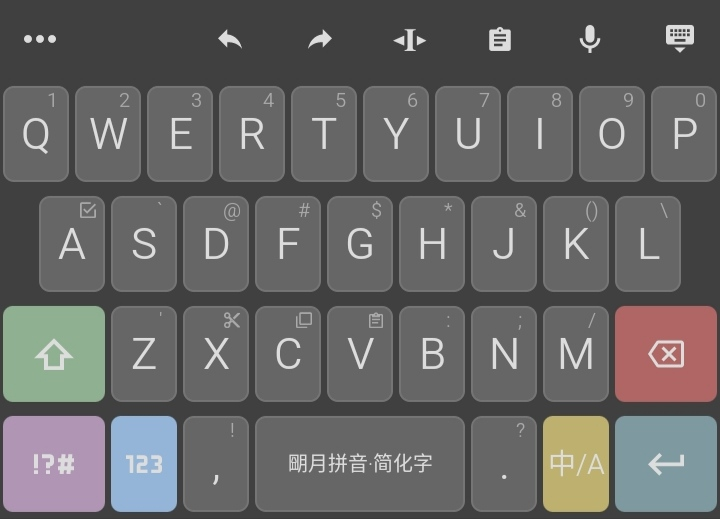
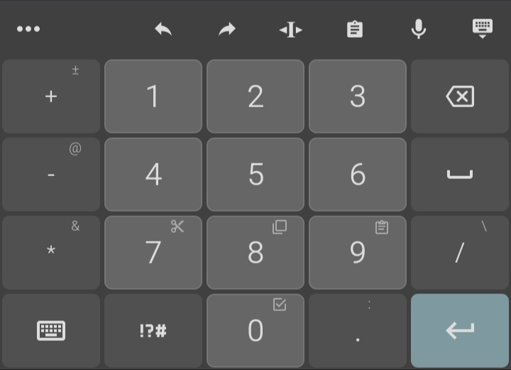
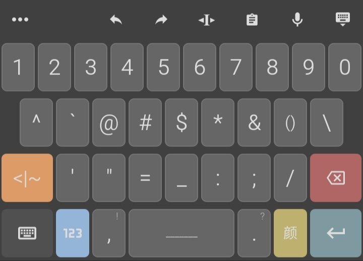
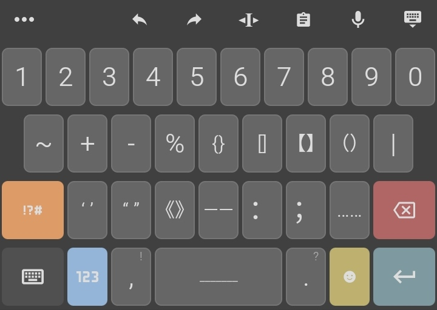
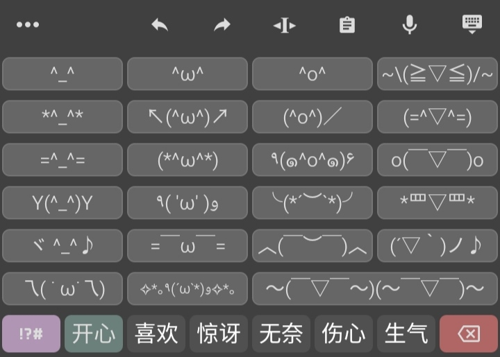
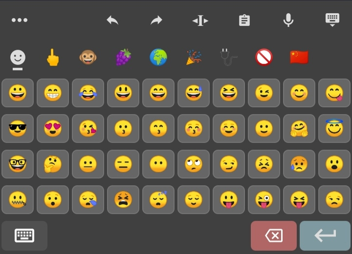

## 我的 trime 配置
适用于`3.3.10`

`td.classic.trime.yaml`基于[classic.trime.yaml](https://github.com/chwt163/mytrime/blob/main/3.3.10/classic.trime.yaml)修改而来

我作出的修改包括但不限于:
- 数字键盘的布局调整
- 重写符号键盘
- 编辑键盘的键位微调
- 修正表情中的分类标识错误

